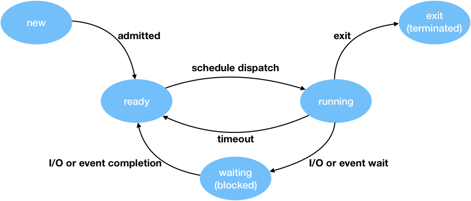

프로세스는 메모리에 올려져서 실행 중인 프로그램을 의미한다. 프로세스의 실행을 관리하는 주체는 CPU이다. CPU는 스케줄링 알고리즘을 통해서 어떤 순서대로 프로세스를 실행하는 지를 결정한다. 

시분할 시스템의 경우 프로세스 응답 시간을 최소화하는 것이 목표였고 멀티 프로그래밍은 CPU 활용도의 최대화가 목표였다. 이처럼 스케줄링 알고리즘은 목표가 있고 그에 따라서 프로세스를 실행한다. 

## 프로세스 라이프사이클

프로세스 라이프사이클은 다섯 단계로 나뉜다.

1. 생성(new) - 메모리에 프로그램이 적재되어 실행 준비 상태
2. 준비(ready) - 순서에 맞춰 처리를 기다리는 상태
3. 수행(running) - 작업이 처리되고 있는 상태
4. 대기(waiting, sleep, blocked) - 어떤 조건에 의해 처리되지 않고 조건이 해결되기까지 대기하는 상태
5. 종료

준비 상태와 대기 상태의 경우 각각 List가 존재한다. List에 있는 프로세스들은 우선순위가 주어져있고 그에 따라서 CPU에서 처리된다.

다음은 사이클 진입을 간략히 설명하도록 하겠다.

- schedule dispatch

    정해진 스케줄링 알고리즘에 따라서 프로세스의 우선순위가 정해지고 그에 따라서 프로세스가 선택 처리된다.

- timeout

    수행 상태의 프로세스의 Time Quantum이 지나면 대기상태로 돌아간다.

- I/O event completion
    
    입출력 요청이나 이벤트가 완료될 경우 대기 상태의 프로세스는 다시 준비 상태가 된다.

- I/O or event wait

    입출력 요청 혹은 이벤트가 발생하여 그 작업이 종료될 때까지 프로세스는 잠시 대기 상태에 빠지고 적절한 우선순위의 프로세스가 수행 상태로 돌입한다.

## 선점형과 비선점형 스케줄링

하나의 프로세스가 다른 프로세스 대신 CPU를 차지할 수 있으면 선점형 스케줄링, 하나의 프로세스가 끝나지 않으면 다른 프로세스는 CPU를 사용할 수 없는 것은 비선점형 스케줄링이다.

## FCFS(First Come First Served)

- 요청된 순서대로 프로세스를 처리(선착순).
- FIFO(First In First Out)인 Queue 자료구조를 사용해서 구현되었다.
- 일괄 처리 시스템에서 사용함.
- 실행 시간이 긴 프로세스가 선 요청되면 효율이 급감한다.
- 비선점형 스케줄링.

## SJF(Shortest Job First)

- 요청 순서와 관계 없이 버스트 시간이 짧은 것부터 처리한다.
- 효율성을 극단적으로 고려했기 때문에 버스트 시간이 긴 프로세스는 계속 뒤로 밀린다.
- 선점과 비선점 모두 가능하다.

> CPU가 하나의 프로세스를 처리하여 완료하는데 걸리는 시간을 CPU 버스트 시간이라고 한다. 

## Priority Based

- 프로세스에 우선순위를 지정하는 것은 정적 우선순위, 상황에 따라 우선순위가 바뀌는 것은 동적 우선순위.
- 우선순위가 같다면 FCFS 스케줄링을 한다.
- 우선순위는 내부/외부적 조건에 따라 정의된다.
- SJF는 버스트 시간이 짧을수록 우선순위가 높은 알고리즘이다. 그러므로 SJF 또한 우선순위 기반이라 할 수 있다.
- 선점과 비선점 모두 가능하다.
- 무기한 봉쇄(Indefinite Blocking)라고 우선순위가 높은 프로세스가 계속 유입되어 우선순위가 낮은 프로세스가 자꾸 뒤로 밀리는 현상이 발생한다.
    - 프로세스의 나이(aging)에 따라서 우선순위가 낮더라도 오래 대기한 경우 우선순위를 높여서 해결할 수 있다.

## Round Robin(RR)

- 현대적인 스케줄링 알고리즘.
- Time Quantum을 기준으로 하여 정해진 시간마다 CPU를 할당한다.
- RR Queue가 존재하여 해당 할당 시간이 지난 프로세스는 빠지고 다시 Queue로 진입해서 대기한다.
- 선점형 스케줄링.
- 버스트 시간이 각기 다른 복잡한 경우에 효율적이다.
- 할당 시간이 너무 크면 FCFS와 다를 바가 없고 너무 작으면 Context 전환이 너무 잦아 Overhead가 발생한다.

> 실행의 최소 단위 시간을 Time Quantum 혹은 Time Slice라고 한다. 일반적으로 10 ~ 100ms이다.

추후에 스케줄링 알고리즘을 그림을 통해 이해를 도울 수 있도록 업데이트 할 예정.
