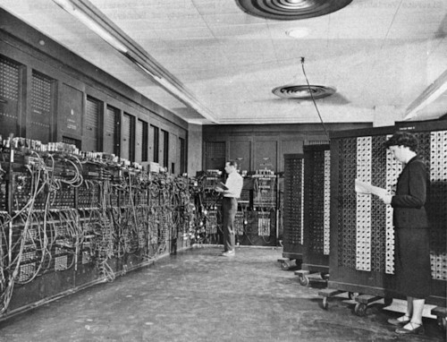
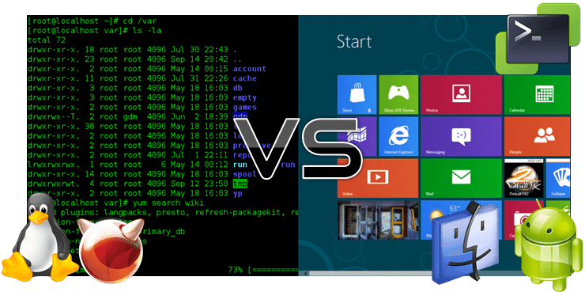

운영체제의 역사를 년도별로 간단하게 짚고 넘어간다.

## 1950년대

최초의 컴퓨터 `ENIAC` 등장.
하지만 운영체제라는 것이 존재하지 않았고 프로그램이 시스템 자원을 직접 제어했다.

참고로 프로그램을 실행하기 위해 연산에 필요한 변수를 하드웨어 수준에서 구현하는 과정만 수 일이 걸렸다고 한다.

## 1960년대 초반

프로그램의 종류와 사용자가 슬슬 많아지기 시작. 그러면서 문제에 봉착하게 된다.

여러 사용자가 하나의 컴퓨터로 각자의 프로그램을 실행시키고자 하면 순서가 정해지게 되는데 실행시간이 많이 소요되는 프로그램을 끝날 때까지 다음 사람이 기다리는 것은 힘들다.

그래서 `일괄 처리 시스템(Batch Processing System)`이 등장했다. 여러 프로그램을 등록하면 중간에 사용자의 개입이 없어도 전체 작업을 처리한다. 이를 기반으로 운영체제가 등장했다.

## 1960년대 후반

프로그램이 실행되고 CPU가 연산을 마친 후 결과를 출력할 때는 할 일이 없어 유휴 상태가 된다. 또한 단일 프로그램만으로는 CPU 혹은 I/O 장치를 항상 바쁘게 할 수 없다.
이런 비효율을 막고자 `멀티 프로그래밍(Multi Programming)`이란 개념이 등장했다. 

멀티 프로그래밍은 CPU의 사용률을 높여 CPU가 유휴 상태 없이 항상 일할 수 있도록 한다. 이와 비슷한 개념으로 `멀티 태스킹(Multi Tasking)`과 `시분할 시스템(Time-Sharing System)`이 있는데
상세한 내용은 추후에 다루도록 한다.

이런 아이디어는 구축이 어렵고 비용이 많이 들었기 때문에 1970년대 초까지 보편화되지 못했다.

## 1970년대

데니스 리치가 C언어로 개발한 제대로된 운영체제 `UNIX`가 등장하며 본격적으로 운영체제의 중요성이 대두되기 시작했다. UNIX는 멀티 프로그래밍과 다중 사용자 지원이 가능한 현대적인 운영체제였으며
이를 계기로 현대 운영체제의 기반이 확립되었다.

## 1980년대

1980년대 이전은 대형 컴퓨터를 여러 사용자가 접속해서 사용했지만 1980년대부터는 서서히 PC가 보급되기 시작했다.

그리고 1984년 애플의 매킨토시 128K가 `GUI(Graphic User Interface)`를 채택하여 출시되면서 GUI 환경의 보급과 발전이 이루어지기 시작했다.
이전에는 거의 대부분 `CLI(Command Line Interface)` 환경을 이용했다.

## 1990년대

GUI 환경의 PC가 보급화되면서 응용 프로그램의 시대가 열렸다. 현재에도 많이 쓰이고 있는 수 많은 응용 프로그램(엑셀, 워드...)이 쏟아져 나왔다.

또한 리누스 토발즈가 `리눅스(LINUX)`를 개발했고 그는 누구나 소스를 읽은 후 패치를 작성할 수 있게하여 오픈 소스 시장이 발전할 수 있도록 기여했다. 리눅스는 GNU 프로젝트와 결합하여 폭발적인 성장을 이루었고 오늘날에는 많은 수의 웹 서버와 모바일 운영체제의 기반으로 자리잡았다.

## 2000년대

오픈 소스 시장이 점점 더 거대해지면서 리눅스 기반의 수 많은 운영체제가 등장했다.

그리고 컴퓨터에서 만드는 가상의 컴퓨터인 `가상 머신(Virtual Machine)`과 `대용량 병렬 처리` 등이 발전하고 있다.