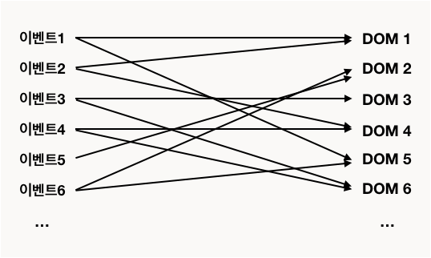
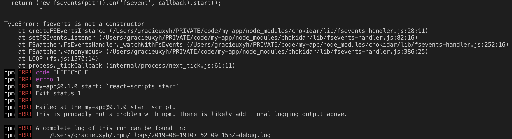
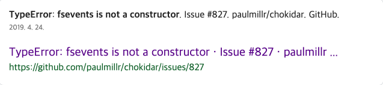
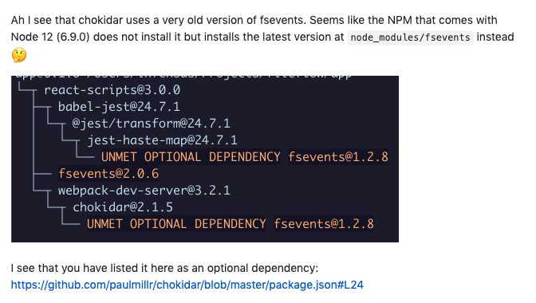

본 게시글은 React를 공부하며 배우고 익히고 느낀 것을 기록한 일지📖입니다.

## 학습의 계기

본인은 Angular2를 6개월, Vue.js를 지금까지 1년 넘게 써왔다. 인턴을 하던 회사에서 AngularJS까지 다루고 최근 다녔던 회사에서는 React Native를 이용했지만 업에 치여서 React를 깊이 있게 학습하진 못했다.

자바스크립트 SPA 프론트엔드 3대장 중 2개를 다뤄봤지만 가장 생태계가 크고 많은 유저가 존재하는 React에 대한 이해도가 떨어진다는 게 마음에 걸렸다. 셋 다 이용해보고 장단점을 몸소 느껴봐야지라는 기술적인 욕심도 분명 있었다.

또한 현재 많은 수의 스타트업과 기업들이 React를 사용 혹은 도입 중에 있기 때문에 React를 다룰 줄 안다는 것은 분명 매력적인 조건임이 분명하기도 했고,, 이런저런 이유가 겹쳐서 React를 공부하기로 결심했다.

단순 학습 후 경험이나 기록이 없다면 까먹을 게 뻔하므로 배운 것들을 이어지는 게시글을 통해 기록할 예정이다.

## React의 등장 배경과 특징

### JavaScript와 JQuery를 통한 DOM 제어

사용자와 상호작용하는 동적인 UI를 만들기 위해서는 DOM을 제어해야한다. 옛날, 아주 먼 옛날엔 순수 JavaScript를 이용해서 DOM을 제어했다.

많은 사람들이 JS를 배울 때 접하는 document.getElementById()로 대표되는 브라우저 Document 객체의 메소드를 통해서 DOM에 접근하여 속성을 제어하는 식으로 말이다.

하지만 이는 코드가 길어지는 단점이 있었고 JQuery가 등장하여 이를 쉽고 간단하게 만들어줬다.

### BackboneJS, EmberJS, AngularJS의 등장

JQuery를 통해 코드의 길이를 줄이고 보다 빠른 개발을 할 수 있게 되었지만 이는 근본적인 해결책이 아니었다. 웹의 크기가 크고 사용자와의 인터랙션이 많아질수록 이벤트가 참조하는 DOM 또한 많아지고
얽히고 섥혀서 아래처럼 복잡한 형태를 띄어 유지보수를 어렵게 만든다.

개발자들은 좀 더 효율적인 방식을 원했고 그래서 Backbone, Ember, AngularJS가 등장한다.
 

이들의 엔진의 자세한 작동 방식은 다 다르지만 __데이터가 변경될 경우 특정 DOM의 속성도 자연스럽게 변형시켜준다__. 유저가 직접 DOM에 접근하는 일은 거의 드물게 되었다. 이 방식은 코드를 매우 많이 줄여 개발에 대한 리소스를 아낄 수 있게 해줬다.

### 그렇다면 React는?

React 개발팀은 이와 달리 생각하여 DOM 속성의 변화가 필요한 경우 DOM을 다 날리고 새로 만드는 방법을 채택했다. 이는 UI를 어떤 방식으로 업데이트해야할까?라는 고민에서 벗어나서 React가
단순히 __UI를 보여주는 것__에 집중하게 해줬다.

혹시 DOM을 새로 그리는 게 속도는 느리지 않을까?라는 생각이 들 수도 있지만 이는 Virtual DOM을 통해서 해결한다. 자세한 것은 후술한다.

### React의 특징

#### 1. JSX

다른 프레임워크와 달리 React는 템플릿 대신 JSX를 이용한다. JSX는 JavaScript XML의 약자로 XML과 유사하게 생긴 JS 확장 문법이다. 이는 JS 내부에 HTML 코드를 작성할 수 있게 해주며 변수나 프로퍼티의 바인딩 또한 제공한다.

HTML과 형태가 매우 유사하여 어렵지 않게 작성이 가능하며 마크업과 로직을 분리하지 않고 UI를 만들 수 있다. 또한 React 컴파일 과정에서 에러를 감지할 수 있어서 유지보수에 도움이 된다.

#### 2. Virtual DOM

Virtual DOM은 말 그대로 가상의 DOM이다. 실제로 존재하는 DOM이 아니라 메모리에 가상으로 존재하는 DOM으로 단순 JS 객체이기 때문에 그 속도가 Real DOM보다 훨씬 빠르다.

상태가 업데이트가 되어 UI의 변화가 일어나면 React는 이를 Virtual DOM에 렌더링한다. 그리고 Real DOM과 비교하여 변화가 감지된 부분을 Real DOM에 반영한다.

그렇기 때문에 정말 필요한 DOM의 변화만을 반영하여 React가 UI Library로서의 기능에만 초점을 맞출 수 있다.

#### 3. Component

기존의 웹은 마크업(HTML), 디자인(CSS), 로직(JS)를 분리하는 기술의 분리에 가까웠다. React는 이 방식이 아닌 컴포넌트를 기본 단위로 한다.

컴포넌트는 쉽게 표현하여 작은 UI의 일부, 조각이라고 생각할 수 있다. 컴포넌트 단위로 코드를 작성하면 확장성, 재사용성, 테스트 가용성 등이 크게 증가한다.

#### 4. One Way Data Flow

React는 상위 컴포넌트에서 하위 컴포넌트로의 단방향 데이터 흐름만을 제공한다. 양방향 바인딩은 개발 비용이 적다고 느낄 수 있지만 장기적 관점에서 데이터의 흐름을 이해하기 어려워 개발 비용이 증가하게 된다.

## React 프로젝트 설치 및 실행

`npx create-react-app my-app`

우선 위의 명령어를 통해 프로젝트 설치했다. 그 후 프로젝트를 실행했으나..

상큼하게 시작부터 `TypeError: fsevents is not a constructor`라는 에러를 맞이한다. 해당 에러를 구글링했다.

맨 위에 해당 에러에 대한 [github issue](https://github.com/paulmillr/chokidar/issues/827)가 열려있다.

chokidar 모듈은 구버전의 fsevents를 사용하는데 node 12의 npm(6.9.0)에서는 해당 버전이 아닌 최신 버전을 설치해서 문제가 생겼다고 한다.
이어서 스크롤을 내려보면 npm이나 node 버전을 다운그레이드 하고 싶지않다라는 코멘트가 몇 개 이어진다. 

npm이나 node의 버전을 낮출 필요가 있을까? 문제되는 것은 fsevents의 버전이다. 그래서 fsevents의 버전만 다운그레이드하면 된다.

`npm install fsevents@1.2.8 -D`

해당 명령어를 통해 1.2.8 버전의 fsevents를 설치했다. 빙글빙글 돌아가는 React 로고가 보인다면 프로젝트 실행에 성공한 것이다.

어쩌다보니 트러블슈팅을 하게 되어서 시간을 소모했지만 다음에도 이런 문제가 생긴다면 혹은 동일한 문제를 겪은 분들이 좀 더 빠르게 대처할 수 있는 글이 되길 바래본다.